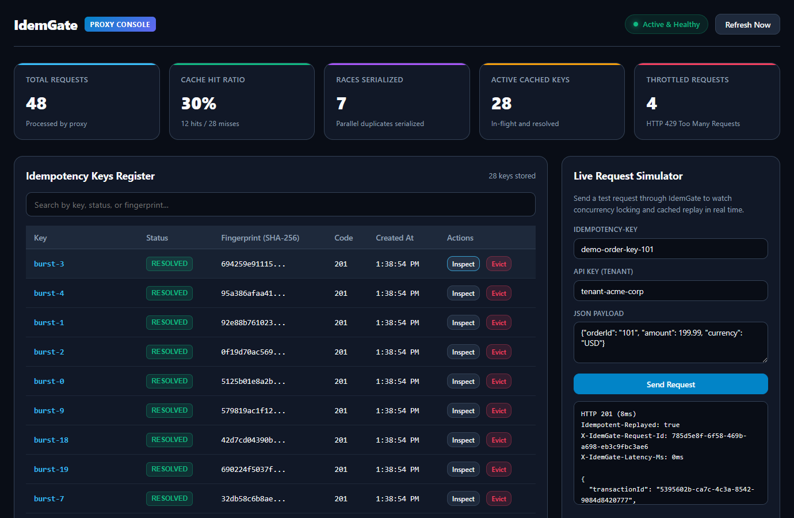
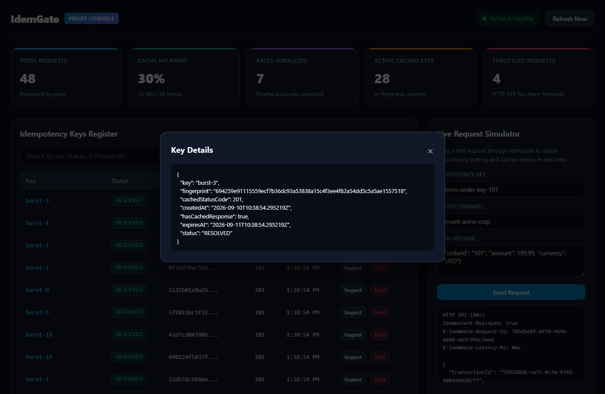

# IdemGate

IdemGate is a reverse-proxy sidecar that handles request idempotency and multi-tenant rate limiting for HTTP services. It implements the IETF `draft-ietf-httpapi-idempotency-key-header-04` specification.

When clients retry requests or send parallel requests with the same `Idempotency-Key`, IdemGate intercepts them before they reach your application. It serializes concurrent duplicates, waits for the initial request to finish, caches the response, and serves the identical result to callers. Upstream services process each unique operation once.

```
                    +---------------------------------------+
                    |               IdemGate                |
[Client Requests] ->| 1. Validate Idempotency-Key           | -> [Upstream Service]
                    | 2. Acquire In-Flight Lock (Redis/Mem) |     (Processes once)
                    | 3. Rate Limit (Token Bucket)          |
                    | 4. Cache & Return Response            |
                    +---------------------------------------+
```

## Features

- **IETF RFC Compliance**: Implements `draft-ietf-httpapi-idempotency-key-header-04` including `Idempotency-Key` validation, payload fingerprinting, and RFC 7807 problem details.
- **Concurrent Race Serialization**: When duplicate requests arrive simultaneously, IdemGate holds secondary requests on a synchronization channel until the first finishes, avoiding duplicate backend execution.
- **Payload & Header Fingerprinting**: Computes a SHA-256 digest over the HTTP method, normalized target path, query string, request payload, and optional whitelisted headers (e.g. `X-Tenant-ID`). Reusing a key with an altered body or header returns `422 Unprocessable Entity`.
- **Dual Backplane Architecture**: Runs with distributed Redis 7+ and Redisson in multi-node clusters, or with an embedded Caffeine and CompletableFuture store for standalone and local development setups.
- **Multi-Tenant & Route Rate Limiting**: Token bucket rate limiting using Redis atomic Lua scripts or an in-memory bucket. Supports tenant extraction, tier overrides, and granular route/method-specific rules.
- **Web Console Dashboard**: Embedded, zero-dependency dark-mode dashboard at `/idemgate/dashboard` featuring real-time metrics, active key inspection, and an interactive request simulator.
- **Operator Eviction API**: REST management endpoints to list active keys (`GET /idemgate/api/v1/keys`) and manually evict poisoned or expired keys (`DELETE /idemgate/api/v1/keys/{key}`).
- **W3C Tracing & Telemetry**: Propagates W3C `traceparent` headers and injects `X-IdemGate-Request-Id` and `X-IdemGate-Latency-Ms` timing headers on all responses.
- **Prometheus Metrics**: Detailed counters and timers covering request volume, cache hits, cache misses, serialized races, and rate-limited calls.

## Quick Start

### Prerequisites

- Java 21 LTS or newer
- Apache Maven 3.9+
- Optional: Redis 7+ (if running in distributed mode) or Docker

### Build

```bash
git clone https://github.com/alexandrmotologa/idemgate.git
cd idemgate
mvn clean package
```

### Run Standalone

By default, IdemGate starts in embedded mode with in-memory storage, proxying requests to an embedded mock upstream:

```bash
java -jar target/idemgate-1.0.0-SNAPSHOT.jar
```

The proxy listens on port `8080` and provides an embedded upstream mock service at `/upstream-mock`.

### Test Idempotency with cURL

1. Send the first request:

```bash
curl -i -X POST http://localhost:8080/api/v1/orders \
  -H "Idempotency-Key: order-req-1001" \
  -H "Content-Type: application/json" \
  -d '{"orderId": "1001", "amount": 250.00, "currency": "USD"}'
```

Response headers will include:
```http
HTTP/1.1 201 Created
Idempotent-Replayed: false
```

2. Send the exact same request again:

```bash
curl -i -X POST http://localhost:8080/api/v1/orders \
  -H "Idempotency-Key: order-req-1001" \
  -H "Content-Type: application/json" \
  -d '{"orderId": "1001", "amount": 250.00, "currency": "USD"}'
```

Response headers will indicate replay from cache without hitting the upstream backend:
```http
HTTP/1.1 201 Created
Idempotent-Replayed: true
Original-Date: Thu, 10 Sep 2026 10:15:00 GMT
```

3. Send the same key with an altered payload:

```bash
curl -i -X POST http://localhost:8080/api/v1/orders \
  -H "Idempotency-Key: order-req-1001" \
  -H "Content-Type: application/json" \
  -d '{"orderId": "1001", "amount": 999.00, "currency": "EUR"}'
```

Response:
```http
HTTP/1.1 422 Unprocessable Entity
Content-Type: application/problem+json

{
  "type": "https://datatracker.ietf.org/doc/html/draft-ietf-httpapi-idempotency-key-header-04#section-2.7",
  "title": "Idempotency Key Payload Mismatch",
  "status": 422,
  "detail": "The provided Idempotency-Key was previously used with a different request payload.",
  "instance": "/api/v1/orders"
}
```

## Concurrency Lifecycle

```
Client 1 (First)         Client 2 (Duplicate)          IdemGate                     Upstream
   |                              |                       |                            |
   |-- POST (Key: K1, Data: D1) ->|                       |-- Compute SHA-256          |
   |                              |                       |-- Acquire Lock (IN_FLIGHT) |
   |                              |                       |-- Forward Request -------->|
   |                              |-- POST (Key: K1) ---->|                            |
   |                              |                       |-- Detect IN_FLIGHT state   |
   |                              |                       |-- Suspend & Subscribe      |
   |                              |                       |                            |-- (Processing)
   |                              |                       |<-- Return 201 Created -----|
   |                              |                       |-- Cache Response           |
   |                              |                       |-- Notify Waiting Clients   |
   |<-- 201 (Replayed: false) ----|                       |                            |
                                  |<-- 201 (Replayed: true)                            |
```

## Web Console Dashboard

IdemGate includes a built-in dark mode management console at `/idemgate/dashboard`. Open `http://localhost:8080/idemgate/dashboard` in a browser to inspect live proxy operations, metrics, and key records:

<p align="center">
  
</p>

The dashboard provides:
- Live metrics for total throughput, cache hit percentage, serialized race conditions, and throttled requests.
- Idempotency key registry displaying SHA-256 fingerprints, HTTP status codes, and single-click manual eviction.
- An interactive request simulator that submits requests through the proxy filter and prints latency and replay telemetry.
- Detailed modal inspection showing stored response headers, expiration times, and payload metadata.

<p align="center">
  
</p>

## Configuration

Set configuration in `src/main/resources/application.yml` or through environment variables:

| Environment Variable | Property | Default | Description |
|---|---|---|---|
| `IDEMGATE_UPSTREAM_URL` | `idemgate.upstream.url` | `http://localhost:8080/upstream-mock` | Target service base URL |
| `IDEMGATE_STORAGE_TYPE` | `idemgate.storage.type` | `memory` | Backplane type (`memory` or `redis`) |
| `IDEMGATE_REDIS_HOST` | `spring.data.redis.host` | `localhost` | Redis server hostname |
| `IDEMGATE_REDIS_PORT` | `spring.data.redis.port` | `6379` | Redis server port |
| `IDEMGATE_LOCK_TTL` | `idemgate.idempotency.lock-ttl-seconds` | `30` | In-flight lock lease duration |
| `IDEMGATE_RECORD_TTL` | `idemgate.idempotency.record-ttl-seconds` | `86400` | Resolved record expiration (24h) |
| `IDEMGATE_RATE_LIMIT_ENABLED` | `idemgate.rate-limit.enabled` | `true` | Enable token bucket rate limiter |
| `IDEMGATE_RATE_LIMIT_CAPACITY` | `idemgate.rate-limit.default-capacity` | `100` | Maximum burst capacity |
| `IDEMGATE_RATE_LIMIT_REFILL_RATE` | `idemgate.rate-limit.default-refill-rate` | `20` | Tokens replenished per second |

See [docs/configuration.md](docs/configuration.md) for full configuration options.

## Documentation

- [Architecture Guide](docs/architecture.md): Internal design, proxy pipeline, and locking model.
- [RFC Compliance](docs/rfc-compliance.md): Details on IETF draft specifications and error handling.
- [Configuration Reference](docs/configuration.md): All settings, rate-limiting tiers, and profiles.
- [Benchmarks](docs/benchmarks.md): Load testing with k6 and concurrency validation.

## License

This project is licensed under the MIT License. See [LICENSE](LICENSE) for details.
